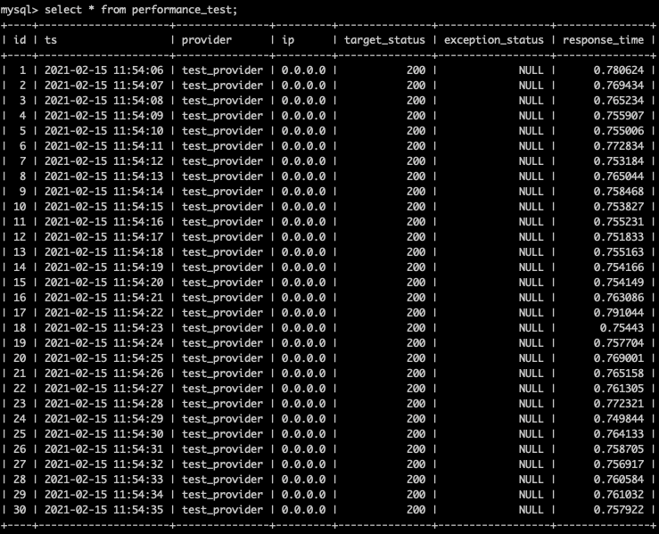

# Performance test

This tool can do requests with provided proxies and store results to mysql database.

## Installation

Create mysql database in your mysql database::

     mysql -u <username> -p <database> < performance_stats.sql
     
Create python virtual environment and install requirements::

    $ cd performance-test
    $ python3.8 -m venv venv
    $ venv/bin/pip install -r requirements.txt
    
## Config

MySQL credentials and target can be set in configuration file::

    BASIC_CONFIG = {
        'mysql': {
            'host': 'localhost',
            'port': 3306,
            'db': 'your_database_name',
            'table': 'performance_test',
            'user': 'your_username',
            'password': 'your_password',
        },
        "target": "https://www.cloudflare.com/cdn-cgi/trace",
    }

A good target to use is "https://www.cloudflare.com/cdn-cgi/trace", as it provides unbiased results.

## API

    $ venv/bin/python -m performance_test --help                                                                                      
    Usage: __main__.py [OPTIONS]
    
    Options:
      --config_path TEXT         Path to config. Default: 'config.py'.  [required]
      --proxies_file TEXT        Path to proxies file. Default: 'proxies.txt'.
                                 Each proxy must be separated with a new line and
                                 formatted in http format.  [required]
    
      --provider_name TEXT       Name of the proxy provider.  [required]
      --test_time INTEGER        Test time in seconds.  [required]
      --requests_number INTEGER  How many requests to do in 'test_time' time
                                 period.  [required]
    
      --help                     Show this message and exit.

## Run performance test

    $ venv/bin/python -m performance_test --config_path config.py \                                                                   
    > --proxies_file proxies.txt \
    > --provider_name test_provider \
    > --test_time 30 \
    > --requests_number 30 \
 
## Results

Results are stored into mysql database using credentials from configuration file.

